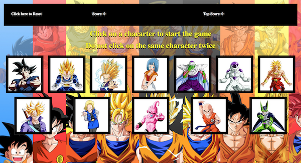
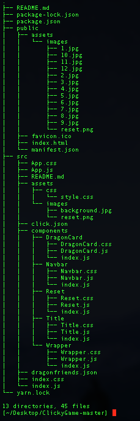

## Test the Game
https://robydoidao2006.github.io/ClickyGame/

## What the Game Looks Like

## Rules of the Game
 - Click on an image and remember which one you clicked.
 - You should not click the same image, the goal its to click all 12 images.
 - On the header there is a reset button, a score mark(keeps track of current points, but resets when you lose) and 
   a top score, wich will keep you highest score, unless you click the reset button or refresh the page.

## This app was built using React.
- You will need to install react in oder to run this localy
- If you haven't already, here is the link to the official react website. https://reactjs.org/
 
## How to Run the Game Localy
- Clone / Download the repository.
- Unzip the file.
- Open your command line
- Cd to the directory 
- In the command line do "yarn install" wait...
- Then do "yarn start".
- Your default browser should open and load the Game automatically.
- If not, just open the browser and type "http://localhost:3000/"
  
## Folder Structure

## Future Improvements
 - Add a real reset button
 - Ass of right now, the button reshesh the page.
 - Add winning and losing conditions.
 - When you get all 12 images, a pop-up message should come up saying that you won or lose.
 - Maybe some music ??

